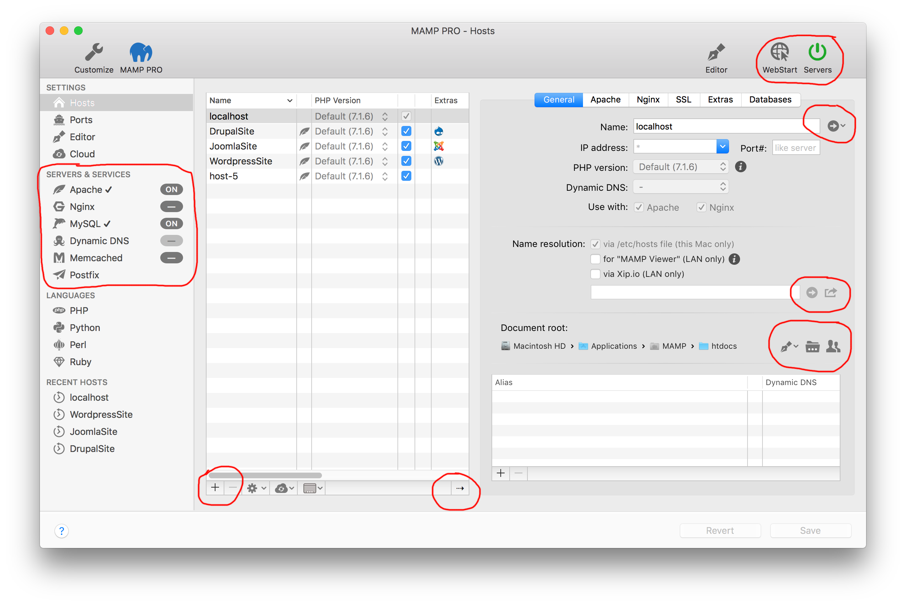
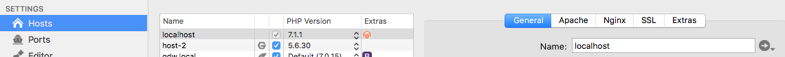
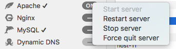

## 起步

当MAMP PRO应用程序第一次启动时，其辅助工具将被安装，系统会提示您输入管理员密码。

单击标题栏中的`Servers`按钮以启动Apache和MySQL，它们是默认启动组的Web和数据库服务器。服务器的启动状态显示在`Servers & Services`区域。`server/service`旁边的复选标记表示当`Servers`按钮被按下时，该服务器/服务将开始/停止。Apache web服务器（默认Web服务器）默认使用8888端口。在浏览器调用本地网页时必须指定此端口，例如：http://localhost:8888 

MAMP PRO的默认主机是`localhost`。localhost的文件最初位于`/Applications/MAMP/htdocs`文件夹中。点击位于Name文本框右侧的按钮，在Web浏览器中打开本地主机。

**备注：
虽然默认的localhost文档根位于`/Applications/MAMP/htdocs`，但最好保留它的文档根目录，而另外添加的地址文件需要放置在`/Applications/MAMP folder`之外。你的host主文档根文件夹的目录结构最好是`~/sites/localhost`,`~/sites/site1`,`~/sites/site2`等...**

-------

#### 添加host
点击位于Hosts左下角的‘+’按钮可以添加新的域名。您将被要求选择文档根文件夹和可选的数据库。关于host是什么以及如何创建其它主机的更多信息，请参阅[Hosts]()部分。

-------

#### 链接到云端
您可以使用云提供商将您的新主机链接到云。以下附加步骤将您的主机链接到云端：

1. 在边栏切换到“Cloud”部分并激活“Use Cloud service”。您将被转移到Dropbox网站以提供您的帐户凭据。允许“MAMP PRO”访问Dropbox上的文件夹并切换回软件。
2. 在侧边栏切换回“Hosts”部分。
3. 点击右下角向右的箭头放大hosts部分，你现在可以看到状态信息。
4. 从步骤4中创建的host的上下文菜单中选择“Save to Cloud”（右键单击或按住Ctrl单击）。一个zip档案将被转移到Dropbox，通过使用上下文菜单中的“Load from Cloud”，可以在同一台或另一台机器上下载。在第二台机器上，主机必须具有相同的名称，并且必须先“Link to Cloud”。

有关将主机存储在云中的更多信息，请参阅[Dropbox]()部分。

-------

#### 主要的GUI元素
* **Customize**
自定义您的工具栏。有关工具栏的其他信息可以在Customize部分找到。
  
* **MAMP PRO**
打开[https://mamp.info](https://mamp.info)网页。
  
* **Editor**
打开MAMP PRO编辑器。有关MAMP PRO编辑器的更多信息可在Editor部分找到。

* **WebStart**
打开本地Web服务器的MAMP PRO开始页面。有关MAMP PRO开始页面的更多信息请参阅Webstart部分。
    
* **Servers**
启动MAMP PRO的当前GroupStart服务。如果任何GroupStart服务已在运行，则停止所有服务。
    
* **Revert**
放弃所有未保存的更改。
    
* **Save**
保存您更改的设置。
    
* **Server & Services**
‘on’表示服务/服务器已经启动，‘-’表示服务已关闭。选中标记表示此服务是‘Groupstart’的一部分。

-------

#### 图标的含义
* 更改文件位置，包括文档根目录或日志文件的位置。

* 为host的Xip.io URL准备的电子邮件。

* 修改文档根文件夹的访问权限。

* 在Finder中打开磁盘位置，或者在Web浏览器中打开一个主机地址。

* 提供更多信息，包括phpInfo()。

* 表示缺少信息。

* 添加一个新的PHP版本。

