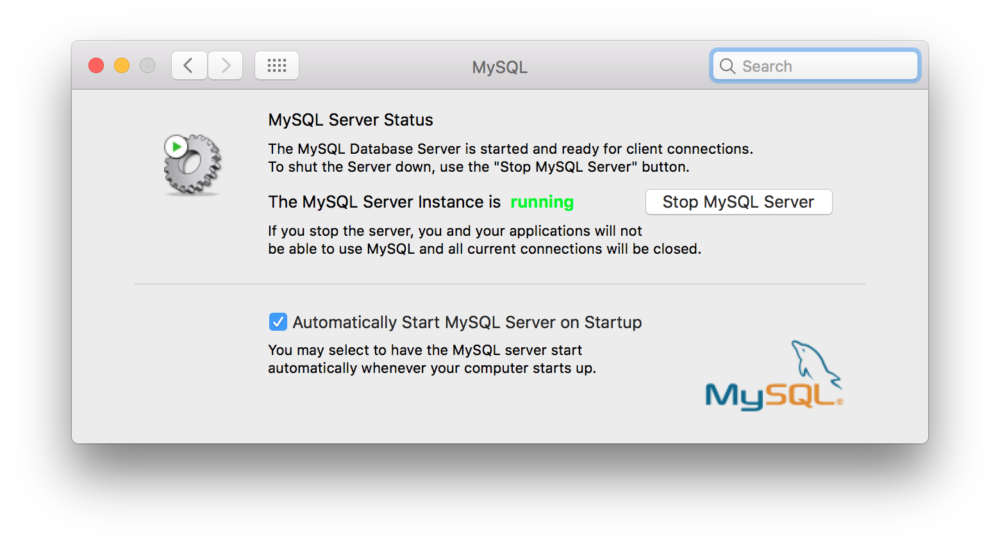
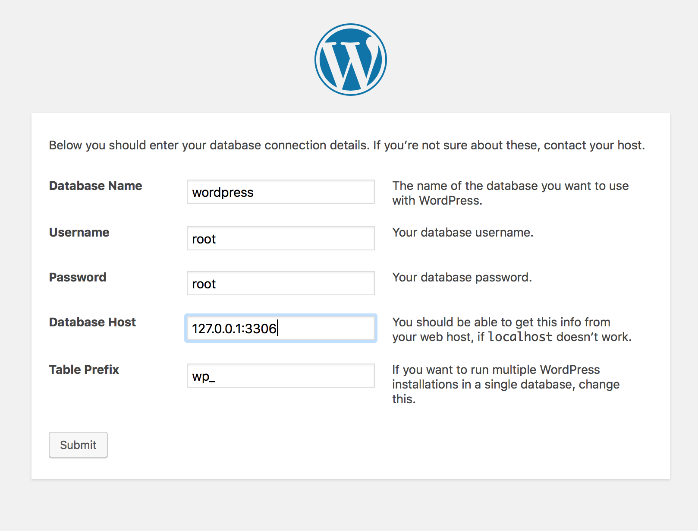

# 升级MySQL到5.7版本
你无法直接升级MAMP PRO中的MySQL，但是你可以在Mac上安装一个单独的MySQL5.7。

> **MAMP无法为安装或者维护MySQL5.7安装提供支持**

----------

1. 下载 [MySQL 5.7 Mac OS X 10.12（x86,64-bit）, DMG Archive](https://dev.mysql.com/downloads/mysql/5.7.html) 或者最近的MySQL5.7版本.
2. 完成MySQL5.7的安装。
3. 在系统设置中启动你的MySQL5.7服务。

一旦成功安装了MAMP PRO，你可以运行两个MySQL，或只运行新的MySQL5.7。如果同时运行，必须在不同端口上运行MySQL。

----------

### MySQL5.7数据默认地址

数据库数据的默认地址是`/usr/local/mysql/data`

----------

### 用MySQL5.7安装Wordpress

在MySQL中创建一个空数据库，此例使用默认名称‘wordpress’。确认使用的是端口3306连接到MySQL。


----------

### 使用PHP连接MySQL5.7
```php
$user = 'root';
$password = 'root';
$db = 'inventory';
$host = '127.0.0.1';
$port = 3306;

$link = mysqli_init();
$success = mysqli_real_connect(
   $link, 
   $host, 
   $user, 
   $password, 
   $db,
   $port
);
```