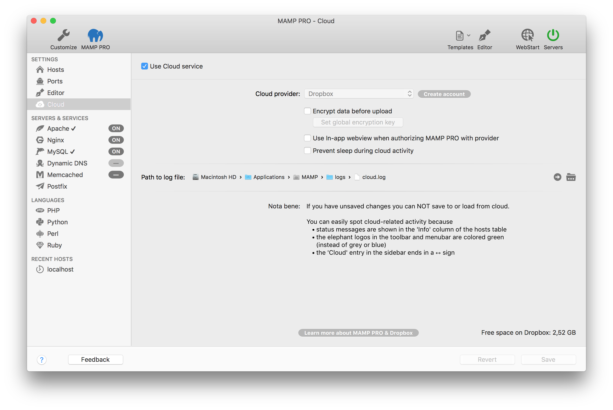

# Cloud端

使用cloud提供程序存储和加载主机和数据库数据。目前Dropbox可用于此选项。没有必要安装Dropbox软件来使用这个功能，你仅仅需要一个Dropbox账户。登录Dropbox并选择设置后，你可以使用hosts表中的功能来保存和加载主机。关于主机cloud功能的更多信息，请访问[此处](../Hosts/Clouds.md)。

**备注：你的文件将不会自动同步，你必须使用菜单栏中的加载、存储和连接命令来手动加载、存储和连接你的主机。**

----------

### 使用Cloud服务

选中此项时，系统会要求登录你的Dropbox账号。完成登录后，你的Dropbox将连接到MAMP PRO。当保存到cloud端，将会保存为zip存档（.zip）或者加密zip存档（.encryptedzip），具体情况取决于加密的设置。你需要将每个主机分别单独连接到Dropbox。

----------

### 在将数据传输到cloud端之前：始终加密数据

使用此功能加密数据，然后再将其移动到Dropbox。你可以使用高级加密标准（AES）和你提供的加密密钥，在将所有数据传输到cloud之前对其进行加密。这个密钥将会被保存到系统密钥链中。如果存在cloud活动项，则无法设置加密密钥。

**设置加密后，你的文件将以 .encryptedzip 扩展名存储在Dropbox。先前存储的主机将保留其未加密的扩展名.zip，直到全部重载到cloud端。**

### 当使用Dropbox授权MAMP PRO：使用应用内网页视图（in-app webview）

如果你的默认web浏览器未设置为Safari，你可能会在使用Dropbox授权MAMP PRO或者切换账户时受到挫折。暂时切换到Safari作为默认浏览器或暂时激活此选项可以解决这些问题。

### 无人值守转移：防止在cloud活动期间休眠

如果cloud活跃，MAMP PRO可以阻止你的电脑进入睡眠模式。在所有cloud端活动结束后，MAMP PRO不再阻止进入睡眠模式。

### 日志文件路径

cloud日志文件的路径，你的cloud活动日志位于`/Applications/MAMP PRO/logs`中。

### Cloud活动

当保存到cloud端时，会被保存为zip存档（.zip）或者加密zip存档（.encryptedzip），取决于加密的设置。此文件会被直接传输到Dropbox。如果你已经安装了Dropbox软件，而且MAMP PRO文件夹并不在例外清单中，在MAMP PRO上传数据后，Dropbox软件将会将文件夹内容下载到`~/Dropbox/Apps/MAMP PRO`中。

当MAMP PRO关掉Cloud活动信号，数据已完全传输到Dropbox。此时，Dropbox软件可能尚未开始将数据重新传输回到原始的计算机。Dropbox并不是MAMP PRO已经完成了云计算工作的指标。

当你在工具栏和菜单栏看到cloud标志为绿色的时候，你可以发现cloud相关的活动。

