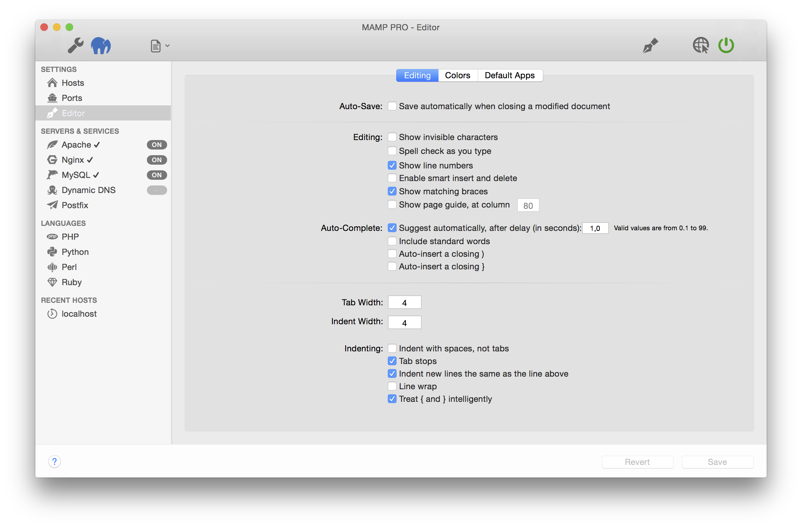
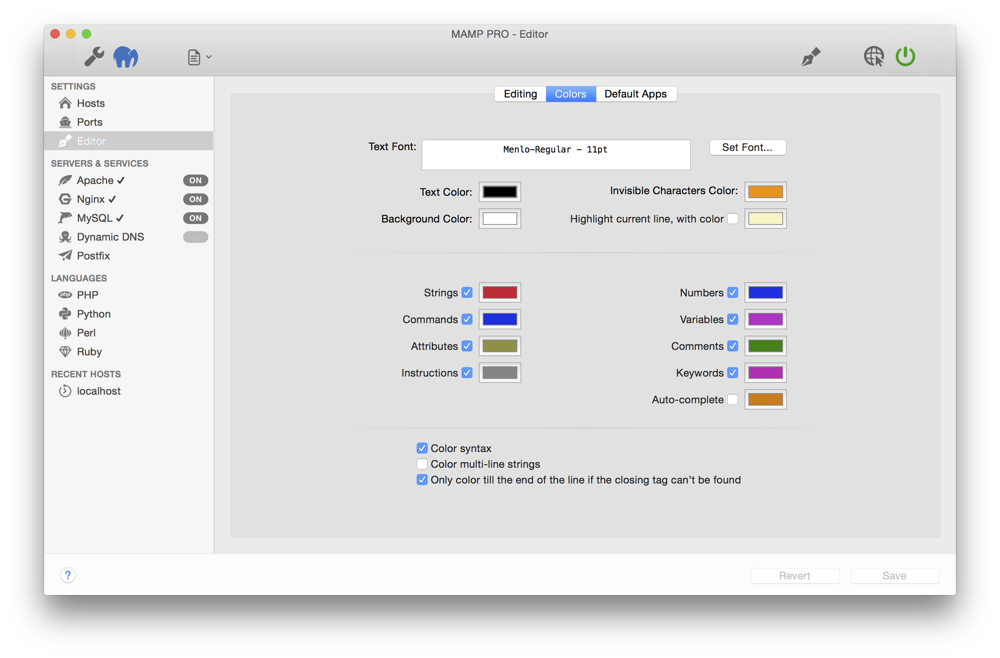
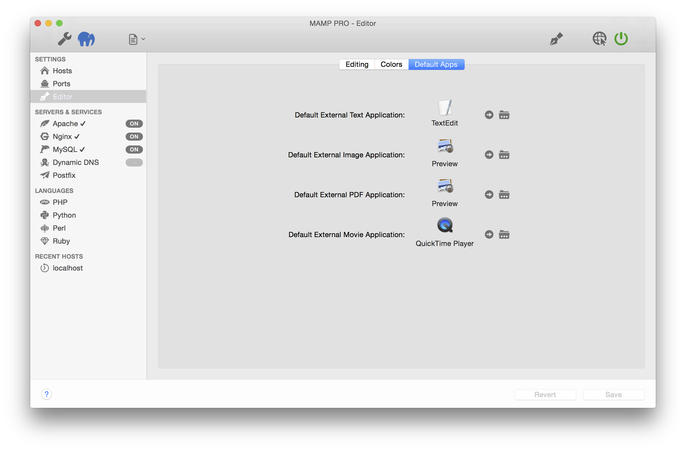

# 编辑器

### **Editing** 编辑

在此处调整文档编辑设置

- Auto-Save: ( 自动保存 )
    - 关闭修改后的文档时自动保存

----------

- Editing: ( 编辑 )
    - 显示不可见的字符
    - 键入时拼写检查
    - 显示行号
    - 启用智能插入和删除
    - 显示匹配的括号
    - 在列中显示页面指南

----------

- Auto-Complete: ( 自动补全 )
    - 延迟后(以秒为单位)自动建议
    - 包括标准词
    - 自动插入结束 ）括号
    - 自动插入结束 } 括号

----------

- Tab Width ( tab宽度 )

    tab键的空格数

- Indent Width ( 缩进宽度 )

    缩进的空格数
    
- Indenting ( 缩进 )
    - 用空格键缩进，非tab键
    - tab停止
    - 新行与上面的行缩进相同
    - 换行
    - 智能区别 { 和 } 

----------

### **Colors** 颜色

此处调整文档颜色设置

   

---------

### **外部应用**

在此处调整默认应用程序设置

 

