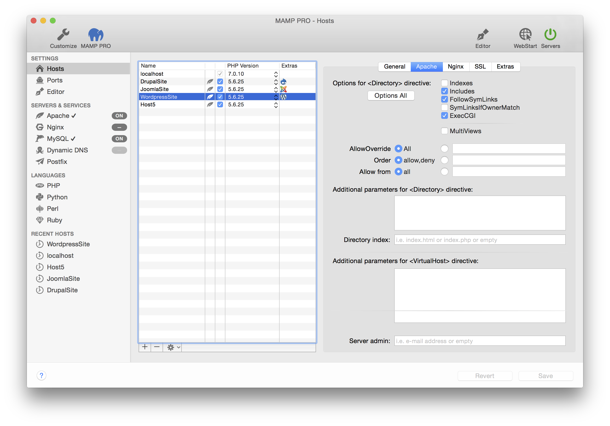

### Apache
 
可为表格中选定的虚拟主机设置Apache选项，这些选项是和安全相关的！关于配置Apache服务器的更多信息在[Apache网站](https://httpd.apache.org/docs/2.2/)可以找到。

* **\<Directory\>选项**
    * **Indexes**
    
        激活或停用“目录浏览”。启用该项时，如果文档根目录中没有index.html、index.php等文件，将显示该文件夹的内容。若无此选项，则不会展示任何内容，或者显示错误消息。 
    
    * **includes**

        允许使用服务端，包括（SSI）。 
        
    * **FollowSymLinks**

        允许使用符号链接作为对其他目录中文档的引用。如果你想要引用目录树外的对象（例如：服务器的协议文件），这是一个很好的功能，但你要清楚，避免通过URL树来隐藏对象。
       
    * **SymLinksIfOwnerMatch**
        FollowSymLinks的受限版本，仅当owner匹配时才允许通过符号连接引用对象。
    
    * **Exec-CGI**
        允许执行CGI。
    
    * **Multiviews**
        允许根据语言使用或禁用动态文档。

-------

* **\<Directory\>指令的其他参数**
    * **文档索引**

        如果没有给出地址或者文件名称，将决定Apache应该服务哪个文件。默认是index.html、index.php之一。
    
* **\<VirtualHost\>指令的其他参数**

    这些指令直接进入httpd.conf文件
    
    * **Server admin**

        Apache将发送错误消息到此邮箱地址
    
    > 备注：留意不要出错，否则Apache将无法启动。 

-------

* **httpd.conf 文件**

    在MAMP PRO中不能直接编辑httpd.conf文件。你需要从httpd.conf模版文件进行自定义配置。关于如何配置httpd模板文件的更多信息，参见 菜单>文件 部分。
[MAMP PRO和httpd.conf, php.ini, my.cnf](https://www.youtube.com/watch?v=tYLykP2CxMM)

* **附加的Apache服务器配置**

    可以包含在`/Applications/MAMP/conf/apache/extra/`文件夹中的配置文件，并添加额外功能或者修改服务器的默认配置。取消注释，然后编辑httpd.conf模版文件中的以下任何配置文件以进行自定义。
    
    * **包括 /Applications/MAMP/conf/apache/extra/httpd-mpm.conf**
    
        关于httpd-mpm.conf的配置信息请看[这里](https://httpd.apache.org/docs/2.2/en/mpm.html)。
    
    * **包括 /Applications/MAMP/conf/apache/extra/httpd-multilang-errordoc.conf**
    * **包括 /Applications/MAMP/conf/apache/extra/httpd-autoindex.conf**
 
        关于httpd-mpm.conf的配置信息请看[这里](http://httpd.apache.org/docs/2.2/en/mod/mod_autoindex.html)。
    
    * **包括 /Applications/MAMP/conf/apache/extra/httpd-languages.conf**
    * **包括 /Applications/MAMP/conf/apache/extra/httpd-info.conf**
    * **包括 /Applications/MAMP/conf/apache/extra/httpd-manual.conf**
    * **包括 /Applications/MAMP/conf/apache/extra/httpd-dav.conf**
    * **包括 /Applications/MAMP/conf/apache/extra/httpd-default.conf**

