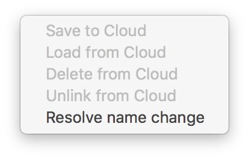

# 云端

主机可以保存到Cloud端，并从Cloud端下载。MAMP PRO将保存文档根文件夹和数据库数据。每个主机的数据将保存在Dropbox的单个zip文件中。使用此功能不需要安装Dropbox软件，只需要通过MAMP PRO的cloud设置登录你的Dropbox账户。

如果有一个数据驱动的主机，必须在保存到cloud之前，先将主机与数据库关联。可在Database选项卡中将主机和数据库关联。

展开查看cloud端主机设置可点击主机表右下方'箭头'按钮。查看cloud功能请点击'cloud'按钮。

-----------

### Cloud端主机表
#### 旧数据

当您的本地数据早于cloud端数据时，你会接收到警告。

主机表中"铅笔"图标表示本地数据比cloud数据旧。

#### Info

显示了当前主机下载状态的信息。向上箭头表示最新的"保存到"日期，向下箭头表示最新的"加载自"日期。

#### Size

表示存储在cloud端的数据大小。

----------

### Cloud 功能
+ 保存到cloud

    当保存到cloud端，MAMP PRO将主机文档根文件夹中的数据和映射到主机的MySQL数据库和表中的数据归档到一个单独的zip文件中，并且可选择使用加密密钥对其进行加密。存档将被转移到cloud端。使用加密时，存档会以.encrytedzip拓展名保存。
    
+ 从cloud下载

    从cloud端加载数据是相反的过程：加载归档完成后，如果需要，它将会被解密、解压缩，然后数据将被复制到主机文档根文件夹并导入回MySQL。
    
+ 从cloud删除

    删除主机的cloud数据

+ 连接到cloud

    连接到cloud端已有的主机。要连接到cloud端，必须使用与cloud端中相同的主机名称。如果不记得想要连接的主机名称，可检查Dropbox。主机的名称正是`~/Dropbox/Apps/MAMP PRO`文件夹中zip文件的名称。
    
+ 取消cloud连接

    如果主机当前正连接到cloud端，将看到此选项，可以取消连接到主机。

+ 解决名称更换

    你可能会更换连接到cloud端主机的名称，当你更改有关联的主机名称时，新的主机名称必须在所有相关联的机器上解决。
    
    举例来说，当你把主机名称从"MyHost2"更改为"MyHost3"，Dropbox将它保存的zip文件名称从"MyHost2.zip"更改为"MyHost3.zip"。你将会在其他关联电脑中收到下列警告，表示你的数据已经过时。
    
    
    
    你可以解决命名的区别
    
    
    
    确认名称的更改
    
    
    
----------

### 桌面功能
+ 保存到桌面

   此功能将存档保存到桌面。这有助于在将数据发送到cloud端之前，查看将要传输的内容，或者确定在cloud端需要多少可用空间。

+ 下载至桌面

    此功能将解密和未压缩的存档保存到桌面。如果要查看当前所选主机存储在的cloud端中的数据，这可能很有用。