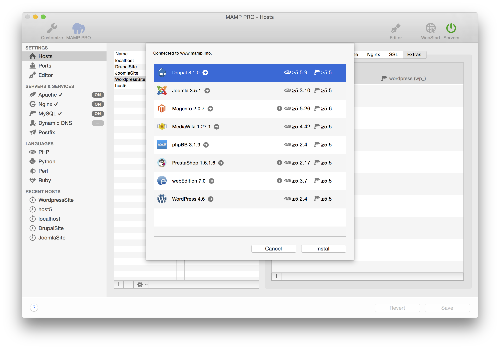

# 附加项

使用MAMP PRO Extras，只需要几次点击即可安装内容管理系统。

Extras面板展示了附加项的名称，每个文档根目录下可以有多少个安装项，以及php语言版本和MySQL兼容性。
    
- [WordPress](http://documentation.mamp.info/en/MAMP-PRO-Mac/Settings/Hosts/Extras/WordPress/)
- [Joomla](http://documentation.mamp.info/en/MAMP-PRO-Mac/Settings/Hosts/Extras/Joomla/)
- [Drupal](http://documentation.mamp.info/en/MAMP-PRO-Mac/Settings/Hosts/Extras/Drupal/)
- [webEdition](http://documentation.mamp.info/en/MAMP-PRO-Mac/Settings/Hosts/Extras/webEdition/)
- [Magento](http://documentation.mamp.info/en/MAMP-PRO-Mac/Settings/Hosts/Extras/Magento/)
- [Mediawiki](http://documentation.mamp.info/en/MAMP-PRO-Mac/Settings/Hosts/Extras/Mediawiki/)
- [phpBB](http://documentation.mamp.info/en/MAMP-PRO-Mac/Settings/Hosts/Extras/phpBB/)
- [PrestaShop](http://documentation.mamp.info/en/MAMP-PRO-Mac/Settings/Hosts/Extras/PrestaShop/)
- [Concrete5](http://documentation.mamp.info/en/MAMP-PRO-Mac/Settings/Hosts/Extras/Concrete5/)
- [Grav](http://documentation.mamp.info/en/MAMP-PRO-Mac/Settings/Hosts/Extras/Grav/)
- [ForkCMS](http://documentation.mamp.info/en/MAMP-PRO-Mac/Settings/Hosts/Extras/ForkCMS/)
- [Bootstrap](http://documentation.mamp.info/en/MAMP-PRO-Mac/Settings/Hosts/Extras/Bootstrap/)
- [opencart](http://documentation.mamp.info/en/MAMP-PRO-Mac/Settings/Hosts/Extras/opencart/)
- [SilverStripe](http://documentation.mamp.info/en/MAMP-PRO-Mac/Settings/Hosts/Extras/SilverStripe/)

**备注：**
**Extra的可用性会受到主机PHP版本、Internet连接项、Extras缓存和可用磁盘空间的影响。要添加附加项，点击Extras面板左下方加号按钮。如果您没有安装Extras，加号按钮周围会有一个红色圆圈。**