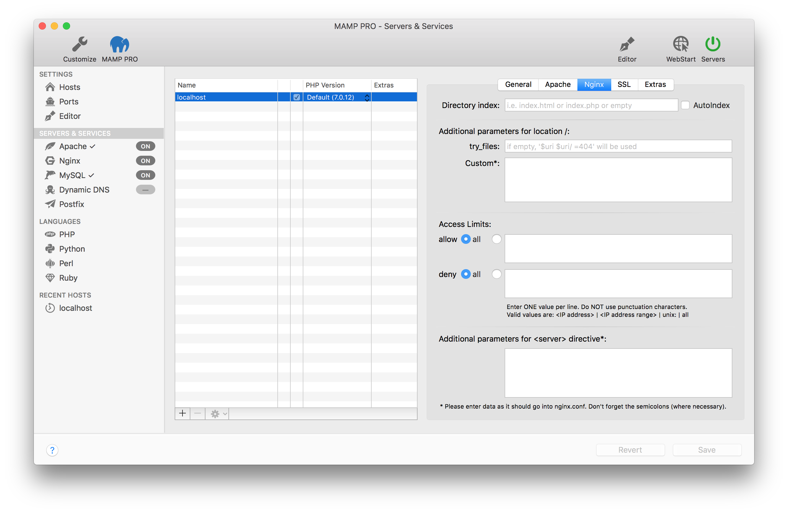

## Nginx

可为表中选定的虚拟主机设置Nginx选项，这些选项是和安全相关的。

> 备注：只有在 Settings > Hosts > General tab 中主机设置了Nginx，才可以更改Nginx配置。

* **Directory index目录索引**

    如果没有在地址中给出文件名称，请确定Nginx应该提供哪个文件。默认是index.html、index.php之一。

* **AutoIndex自动索引**

    激活或禁用“目录浏览”。启用该项时，如果文档根目录中没有index.html、index.php等文件，将会显示文件夹中的内容。若无此选项，不会展示任何内容，或可能显示错误消息。
    
-----

* **Additional parameters for location:/**
    * **try_files**
    * **Custom**

-----

* **Access Limits 访问权限**
    * **allow**
        
        在这里插入访问限制
        
    * **deny**
        
        在这里插入禁止访问限制
        
-----
 
 * **\<server\>指令的附加参数**
    
    在这里添加\<server\>指令的附加参数
    
> 注：留意不要出错，否则Nginx将无法启动。

-----

* **nginx.conf File**
  
    你无法在MAMP PRO中直接编辑ngix.conf文件。只能从ngix.conf模板文件进行自定义配置。关于如何配置nginx模板文件的更多信息，参见 菜单>文件 部分。
    
    [MAMP PRO and httpd.conf, php.ini, my.cnf](https://www.youtube.com/watch?v=tYLykP2CxMM)
    

