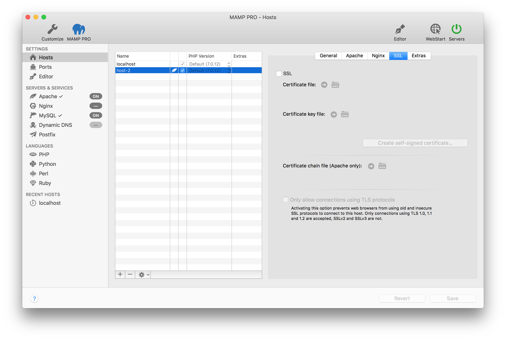
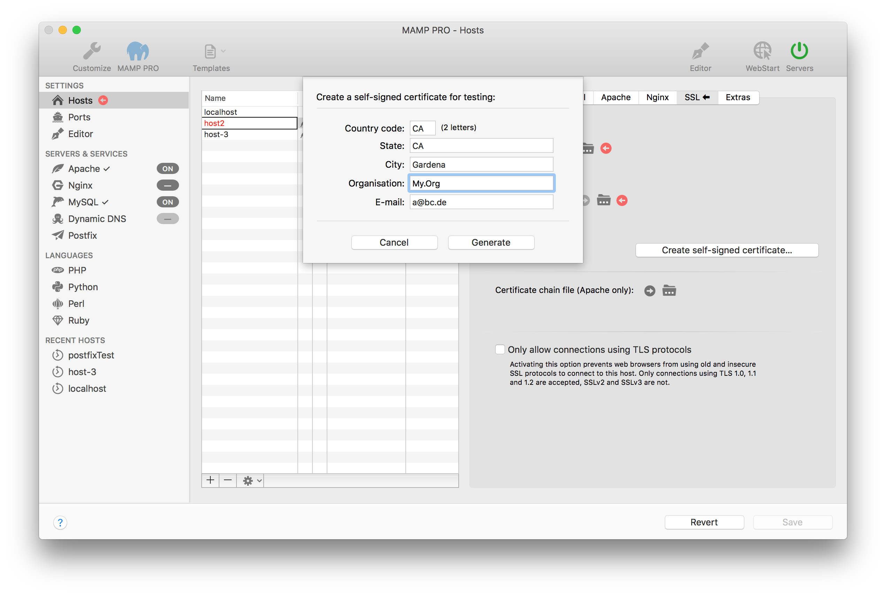
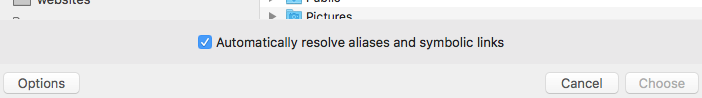

## SSL

在web浏览器中使用SSL给来自Apache的流量加密。想要保证生产服务器的安全，你应该从认证中心（CA）获取证书文件和证书密钥文件。可使用”虚拟“证书测试SSL功能。

* **SSL**

    选中以启用SSL。创建或启用SSL证书后，你的网站现在将使用https了。

    * **Certificate File 证书文件**
        
        指向证书文件，目录对话框只能识别 .crt 文件
         
    * **Certificate Key File 证书密钥文件**
        
        指向证书密钥文件，目录对话框只能识别 .key 文件
        
    * **Create Certificate Self Signed Certificate … 创建自认证证书文件**
    
        如果要测试SSL功能，使用“创建自签名证书”。浏览器无法识别此证书，当在浏览器中查看网站时，必须点击那些警告。
        

-----

* **Certificate Chain File 证书链文件（仅Apache）**
        
    指向链文件或者别名
    

-----

* **Only allow connection using TLS protocols 仅允许使用TLS协议连接**

    激活此项可阻止web浏览器使用旧的不安全的SSL协议连接到本机。只接受使用TLS 1.0,1.1和1.2的连接，SSL v2和SSL v3则不接受。
    
-----

关于如何让主机同时使用ssl和非ssl的的信息，请参阅[操作指南]()部分。

关于如何使用MAMP PRO界面将http主机重定向到https的信息可以在[操作指南]()部分找到。

关于如何使用.htaccess文件将http主机重定向到https的信息可以在[操作指南]()部分找到。

