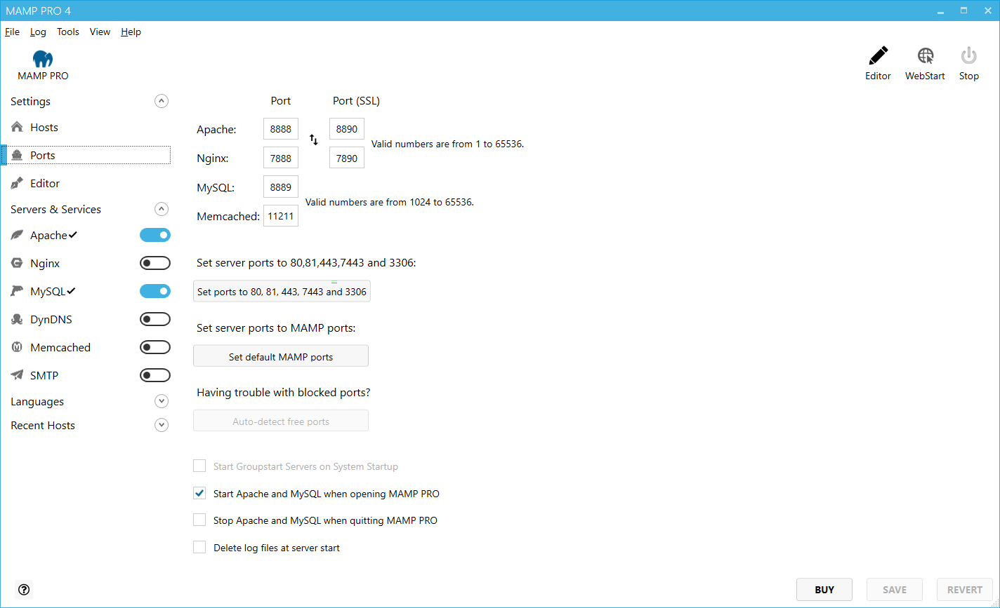

# 端口
当通过网络查询地址时，需要给服务器程序分配某个网络端口。这样，多个服务程序可以在一台服务器上运行。每个服务有一个默认端口：Apache Web服务器通常使用端口80，MySQL数据库服务器使用端口3306。

这些端口是可配置的。MAMP PRO的默认配置使用端口8888， 8889和8890。这样，MAMP服务器可以和安装在Mac上的其他服务器一起运行。如果端口8888，8889或者8890正被其他应用程序使用，请相应地更改值。

`Set prots to 80, 443 & 3306`按钮将会使用网络上通常使用的端口值，`Set default MAMP prots`将会重置Apache、Nginx和MySQL的端口为8888，8889和8890。`Auto-detec free port`将帮你找到Mac上可用端口。

- **运行服务器**：

生产服务器通常使用www/msql来运行Apache，Nginx和MySQL。这些用户可能无权访问你的文件，因此通常最好在您自己的用户名下来运行它们。

**备注：只有当计算机收到足够保护，才能免受来自网络的恶意攻击，才可以使用自己的用户名启动服务器。服务器上的恶意脚本可以无限制地访问您的个人数据。**

----------

- **Launch Groupstart servers on system startup** （ 系统启动时启动Groupstart服务器 ）

    Apache、Nginx、和MySQL在启动OS（操作系统）期间启动。这意味着在用户登录系统的时候，这些服务都可用。
    
- **Launch Groupstart servers when starting MAMP PRO** （ 启动MAMP PRO时启动Groupstart服务器 ）
    
    服务将在MAMP PRO启动时自动开启。
    
- **Stop servers when quitting MAMP PRO** （ 退出MAMP PRO时停止服务 ）

    当MAMP PRO关闭时，服务将自动停止。
    
- **Delete log files at server start** （ 在服务启动时删除日志文件 ）

    在启动服务器之前，日志文件将被清空。如此只有当前条目才会出现在日志文件中。

