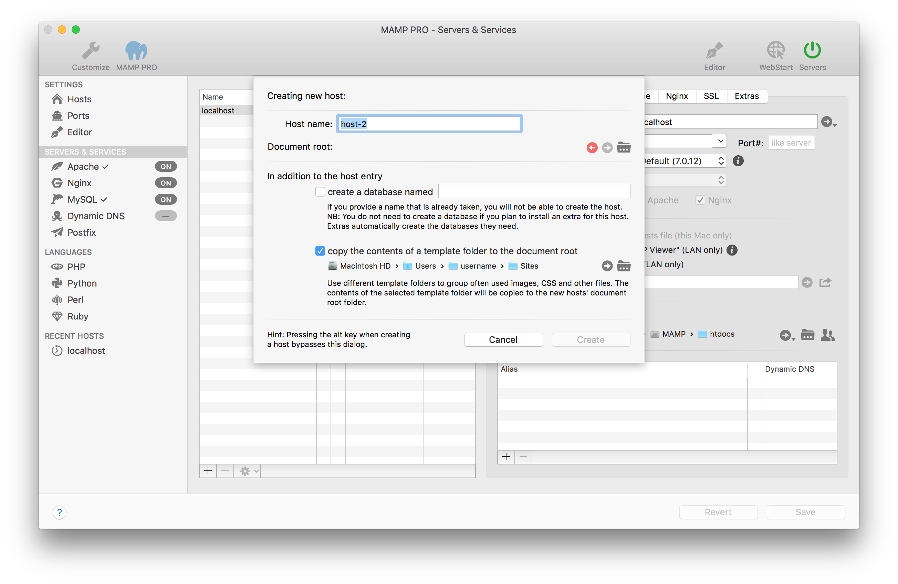
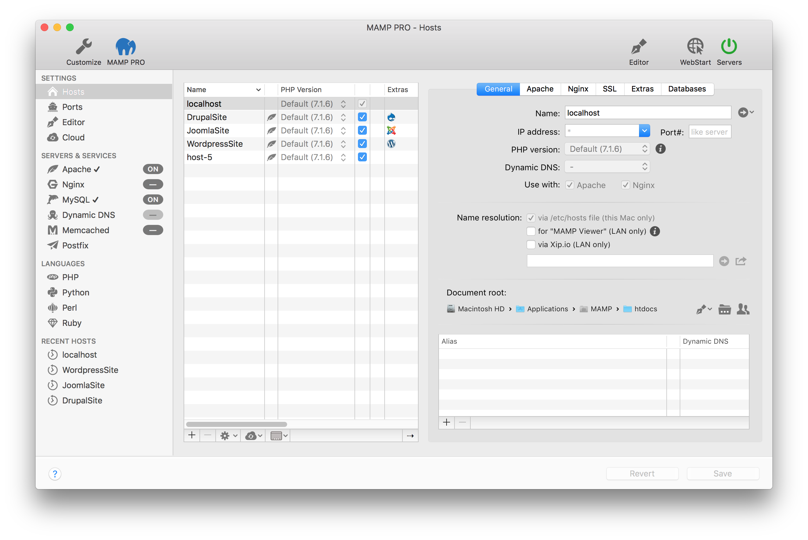
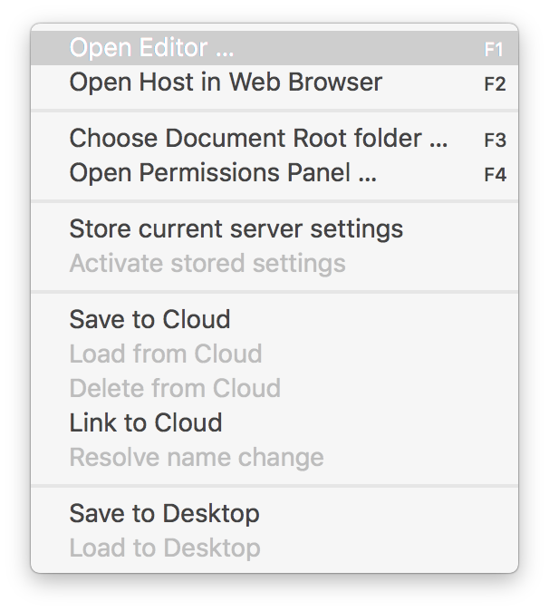
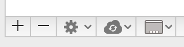
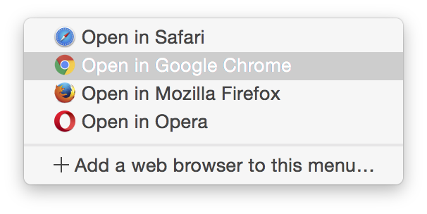
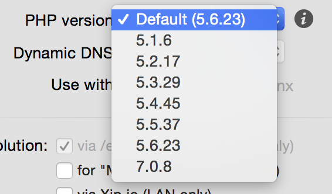
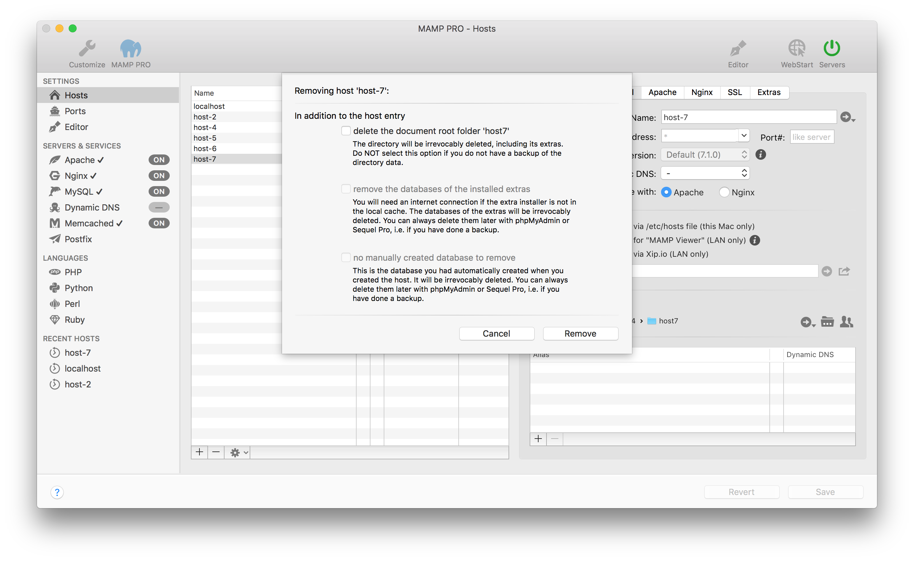

### 通用

MAMP PRO使用虚拟主机使你的网络服务器为不同的网站提供服务。虚拟主机`localhost`是默认创建的，无法删除。你可以为每个项目创建主机，添加不限数量的主机。每个主机可以拥有自己的目录存储html，php文件和图像，该目录被称为文档根目录。

主机名称（服务器名称）必须是唯一的，实际上通常使用反向域名命名机制来识别它们(例如：使用 de.appsolute.mamp替代 mamp.appsolute.de)。未反转的域名可能与外部域名冲突。要使主机既有ssl也有非ssl，你必须两次使用相同的名字创建主机。

想要创建新的主机，单击屏幕左下角的`Plus`按钮。

##### 域名

在MAMP PRO中，服务器名称和端口号必须是唯一的。主机名只能
包含字母、/、或者数字，以及短横线‘-’，但是不能以‘-’字符开头或者结束。名称不区分大小写（大写和小写字母不区分）。

##### 根目录

虚拟主机的文档（HTML/PHP等文件）的位置称为文档根目录。文档根也被称为Web根文件夹。如果文件夹为空，MAMP PRO会在你的web服务器重新启动时自动将`index.php`文件和MAMP映象添加到此位置。如果你想要用作文档根目录的文件夹置灰，可能是权限出了问题。可以通过更改你的服务启动用户来解决。

-------

##### 创建一个已命名数据库

你可以选择创建一个MySQL数据库。大多数内容管理系统都需要一个数据库，你可以在这里方便地添加一个。

##### 将模板文件夹的内容复制到文档根目录

你可以选择添加模板文件夹的内容，你可以在你创建的每个站点使用相同的模板、js和css文件/文件夹。使用此选项可将模板文件夹的内容复制到新的文档根文件夹中。

-------

##### Hosts表
hosts表包含多列，你可以拖动列来更改其默认顺序。在默认顺序中，第一列包含你的host名称，第二列指出托管该文件的web服务器。

第三列表示主机是否处于活动状态。如果未选中，主机不会处于活动状态，且无法在web浏览器中查看。

第四列包含主机使用的php版本，如果安装了Extra，第五栏将显示Extra的图标。

高亮显示的host上单击右键，有常用功能的快捷方式。

在hosts表的底部有一些功能，点击图标将会突出显示几个功能，可保存至你的主机设置，以便以后重新编辑。如果你进行了服务器更改并且稍后发现你的站点不再可访问，这可以用作备份。

hosts表还包含了cloud信息和功能，可以在[这里](http://documentation.mamp.info/en/MAMP-PRO-Mac/Settings/Hosts/Cloud)找到。

-------

##### 命名

在MAMP PRO中，服务器名称和端口号必须是唯一的。主机名只能
包含字母、/、或者数字，以及短横线‘-’，但是不能以‘-’字符开头或者结束。名称不区分大小写。

如果服务器正在运行，你可以使用按钮在web浏览器中打开主机地址。

##### IP地址

如果此字段留空或者包含`*`，则web服务器将使用一台计算机的IP地址访问此主机。如果你想要选择哪个IP地址来连接主机，请从弹出菜单中选择它。

##### 端口#

决定可以访问虚拟主机的端口。有效值从1到65535。在大多数情况下，预设值不需要更改。

##### PHP版本

确定主机将使用哪个版本的PHP。只有在MAMP PRO的PHP部分设置了每个主机的独立PHP版本时，才能设置此项。

如果你选择了标准PHP版本，如果你在PHP选项中选择新的标准版本，MAMP PRO将自动适应此项设置。使用固定设置告诉MAMP PRO不要更换PHP版本。

听上去很复杂？让我们来看一下案例：默认版本被设置为5.5.9，你有个主机oneHost的PHP版本设置为`Default （5.5.9）`，另外一个主机anotherHost被设置为`5.5.9`并且还有另外一个主机yetAnotherHost 设置为`5.3.28`。如果你在PHP部分设置PHP版本为`5.4.25`，MAMP PRO将修改oneHost的PHP版本到这个版本（它被设置为始终使用标准版本）。另外两个主机不会更改。
[在MAMP PRO中设置PHP版本](https://www.youtube.com/watch?v=fsOWq9k_OAc)

    通过单击版本名称右侧的‘i’按钮查看php配置。

##### 动态DNS
决定虚拟主机是否可以通过互联网上的的动态DNS服务访问。

##### 使用
决定你的主机将使用何种web服务。在服务器列表中服务器名称旁边的图标指示出你选择了哪个web服务器。

-------

#### 名称解析

这将决定你的系统如何将主机名映射到ip地址。

* **via /etc/host file (this Mac only)**

使用`/etc/hosts`文件的基本映射机制

* **for “MAMP Viewer” (LAN only)**

使你的主机地址能够在MAMP查看器上查看。

* **via Xip.io (LAN only)**

允许本地网络上的其它计算机访问你的网站。使用分享按钮，你可以将Xip.io地址发送给其他用户。

    ** 备注：Xip.io地址仅在本地网络中使用。它们是临时的，如果你重启Mac，可能会失效。同时确保你的网络路由没有使用DNS重新绑定保护来阻止Xip.io的访问。如果路由器执行此操作，你可以停用此功能，将Xip.io添加为例外，或者在Mac电脑网络设置中不使用路由器作为DNS服务器 **
[使用xip.io网站](https://www.youtube.com/watch?v=sYHPYCDvU1Q)

##### 文档根目录

虚拟主机的文档（HTML/PHP文件等）的地址被称为文档根目录。

##### 文档根目录的访问权限

为了使web服务器能够访问文档根文件夹内的文件，并将他们提供给web浏览器，它需要足够的权限。如果你使用用户`www`启动你的web服务器，则该用户必须有权访问根文件夹中的文件。
通常情况并非如此。你可以调整访问权限，也可以使用当前的Mac用户启动web服务器。

在网站的开发阶段，使用当前Mac用户启动web服务器更为简单。用户`www`通常只在生产服务器上使用。

如果你的web服务器在错误日志里报告了‘access denied’或部分网页丢失，可能是由于访问权限引起的问题。

MAMP PRO的权限对话框第一眼看起来很复杂，但实际上非常强大。不仅仅显示对文档根文件夹的访问权限，还会显示其中所有子目录和文件的所有权限。‘-’表示并非所有对象都有相同的权限。

* **Owner**

拥有该目录以及其中的所有子目录和文件的用户。

* **Group**

拥有该目录以及其中的所有子目录和文件的用户组。

* **Access Rights**

你可以分别更改文件夹和文件的访问权限。

##### 别名
别名是你的虚拟主机的额外名称。对于主机本身的命名约束，也同样适用于这些附加名称。使用`plus`按钮可以添加别名。

-------

关于如何使用命令行创建主机的信息可以在[这里](http://documentation.mamp.info/en/MAMP-PRO-Mac/How-Tos/General)查看

-------

要删除一个新的主机，单击屏幕左下角`Minus`按钮。

* **删除文档根目录文件夹**

MAMP PRO将会删除你的文档根目录和其中所有的内容

* **移除多余的数据库**

如果你的主机是一个Extra，MAMP PRO将会删除Extra数据库中安装的数据库

* **移除创建的数据库手册**

删除创建主机时安装的数据库。

